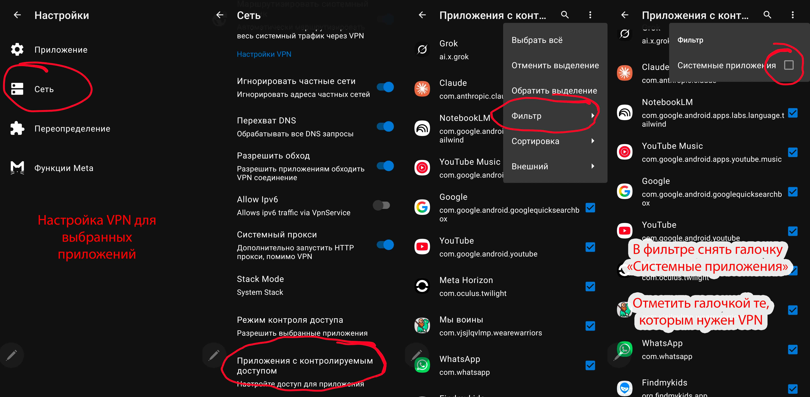
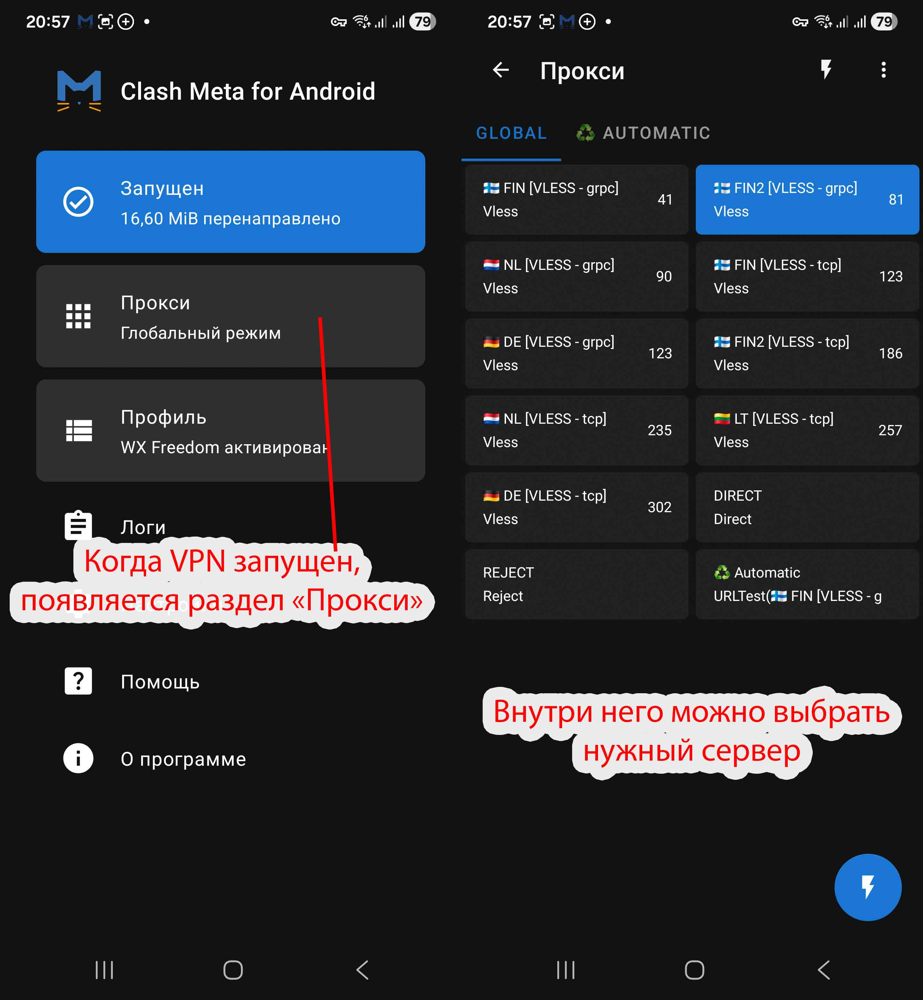

# Android

## Шаг 1. Скачайте и установите приложение

[Скачать Clash Meta for Android](bin/cmfa-2.11.24-meta-universal-release.apk)

Откройте скачанный `.apk` и установите приложение. Если Android заблокирует установку, разрешите установку из неизвестных источников в настройках.

## Шаг 2. Добавьте профиль

1. Скопируйте ключ, который я отправил
2. Откройте раздел **Профиль**
3. Нажмите **+** в правом верхнем углу
4. Выберите **URL - Импорт из URL**
5. Укажите любое название, вставьте ключ в поле **URL подписки** и сохраните

## Шаг 3. Выберите приложения для VPN (опционально)

Если нужно, чтобы через VPN работали только выбранные приложения:

1. Откройте **Настройки → Сеть → Приложения с контролируемым доступом**
2. В меню **Фильтр** снимите галочку **Системные приложения**
3. Отметьте галочками те приложения, которым нужен VPN

## Шаг 4. Запустите VPN и выберите ключ

1. На главном экране нажмите на верхний блок, чтобы запустить VPN
2. Когда VPN запущен, появится раздел **Прокси** - откройте его
3. На вкладке **GLOBAL** выберите нужный сервер

> **Важно:** не выбирайте ключи с пометкой **Аварийный**. Используйте их только в случае, если не работает ни один из обычных ключей.

