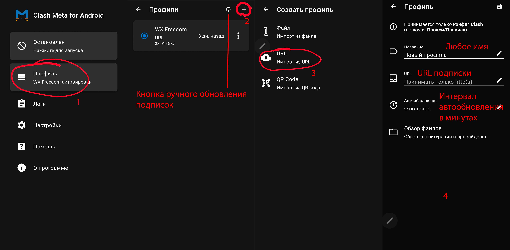
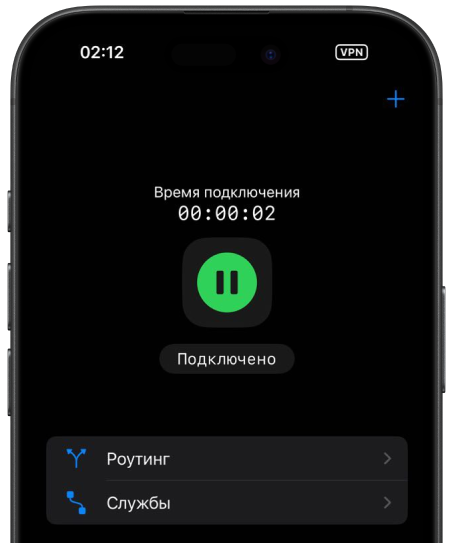

# Android

## Шаг 1. Скачайте приложение

[Скачать V2RayTun из Google Play](https://play.google.com/store/apps/details?id=com.v2raytun.android&hl=ru)

## Шаг 2. Импортируйте конфигурацию

1. Скопируйте ключ который я отправил
2. Нажмите на кнопку **+** в правом верхнем углу
3. Выберите **Import from clipboard**

4. Нажмите на кнопку подключения в центре экрана

> **Важно:** не выбирайте ключи с пометкой **Аварийный**. Используйте их только в случае, если не работает ни один из обычных ключей.

