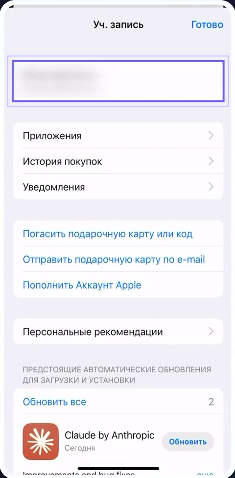
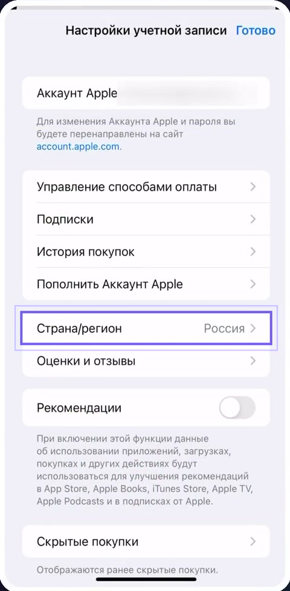
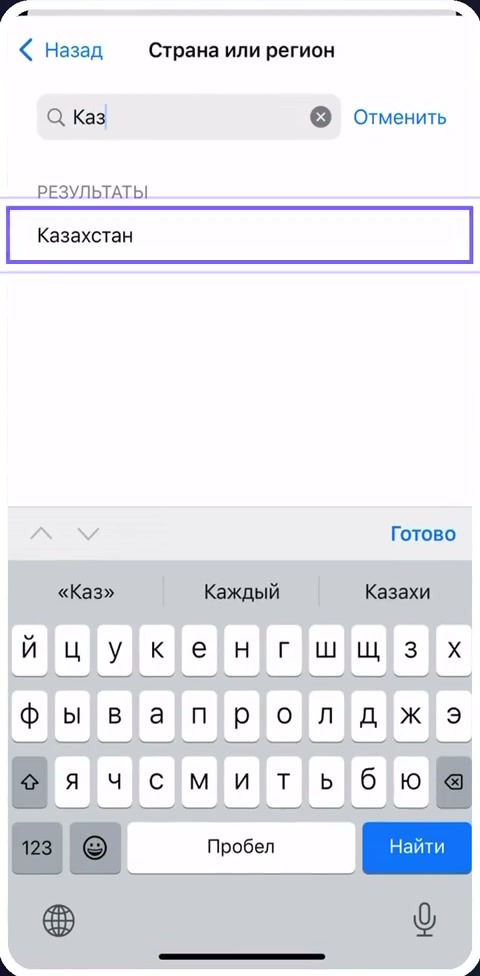
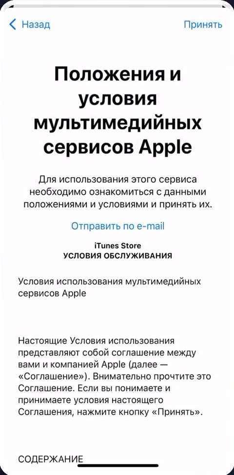
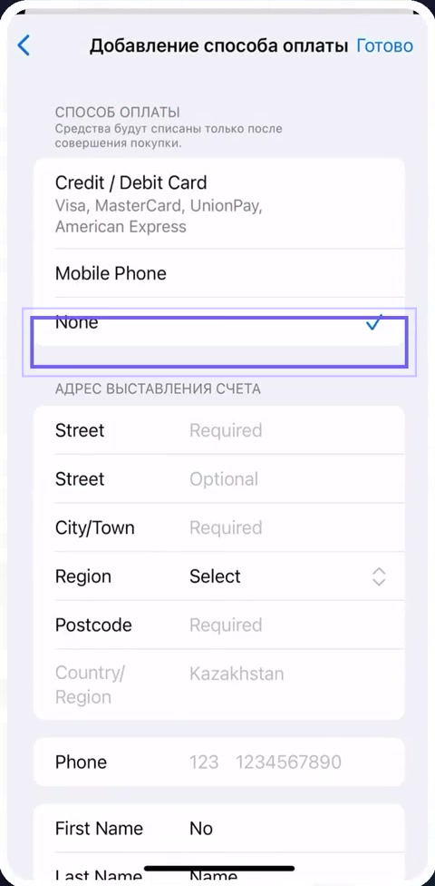
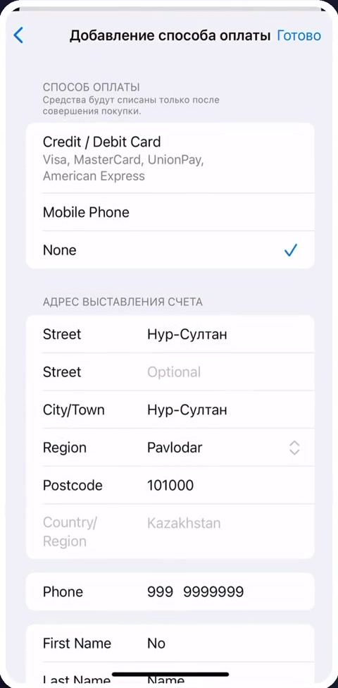
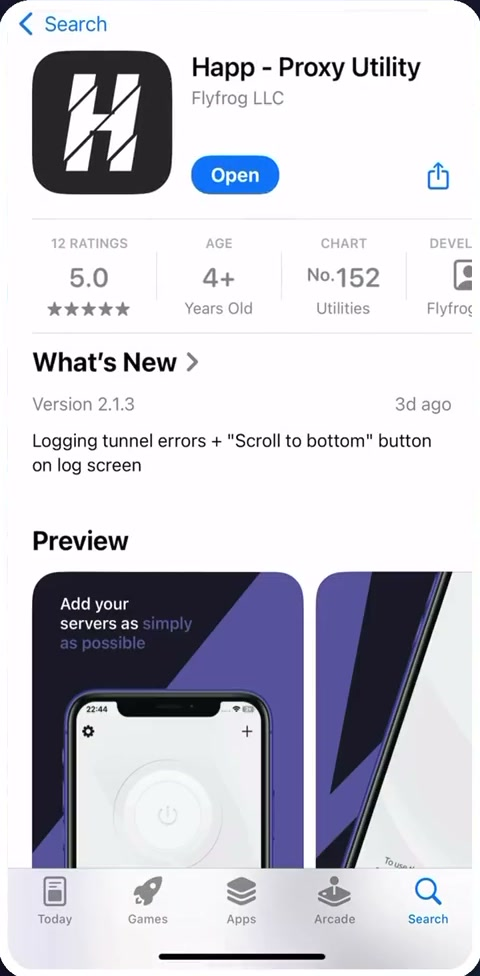

# Как сменить регион App Store (iPhone / iPad)

Некоторых приложений нет в российском App Store - например, полной версии Happ. Чтобы их установить, временно смените регион App Store на Казахстан. Это занимает пару минут, карта не нужна.

## Шаг 1. Откройте профиль

Откройте App Store и нажмите на иконку профиля в правом верхнем углу.

## Шаг 2. Откройте учётную запись

Нажмите на строку с вашим именем.

## Шаг 3. Откройте настройки страны

Нажмите **Страна/регион**.

## Шаг 4. Выберите Казахстан

Введите в поиске "Каз" и выберите **Казахстан**.

## Шаг 5. Подтвердите смену

Нажмите **Продолжить**.

## Шаг 6. Примите условия

Пролистайте условия до конца и нажмите **Принять** в правом верхнем углу.

## Шаг 7. Заполните способ оплаты и адрес

1. В разделе **Способ оплаты** выберите **None**

2. Заполните адрес - подойдут любые данные, например:
   - **Street** и **City/Town** - Нур-Султан
   - **Region** - Pavlodar
   - **Postcode** - 101000
   - **Phone** - любой номер, например 999 9999999
3. Проверьте данные и нажмите **Готово** в правом верхнем углу

## Шаг 8. Установите приложение

Найдите в App Store **Happ - Proxy Utility** и установите его.

## Важно

Регион можно вернуть обратно теми же шагами - установленные приложения останутся на телефоне.

Дальше добавьте подписку по [инструкции для Happ](happ.md).

---

[← К выбору операционной системы](README.md)
