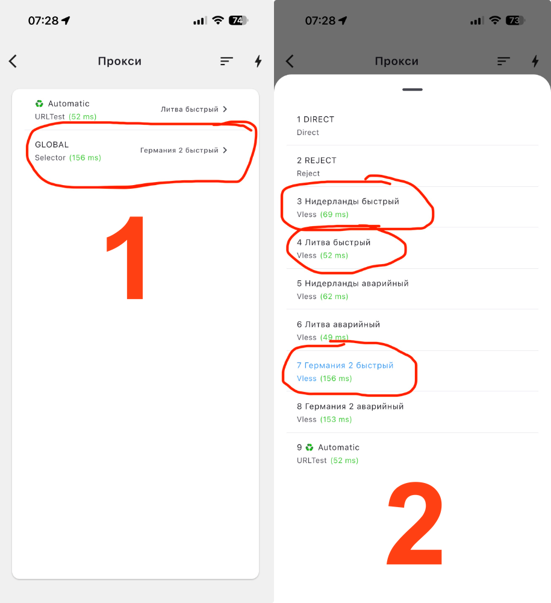
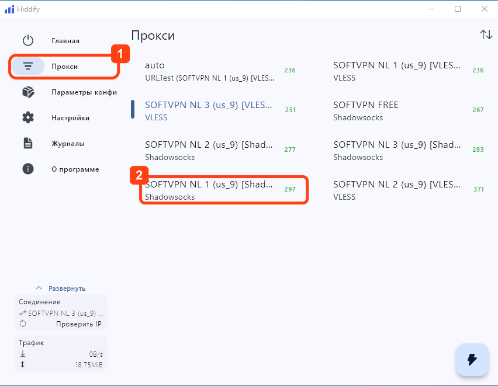
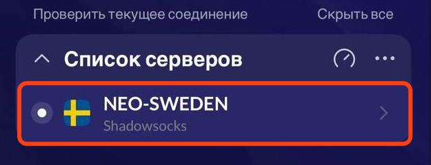
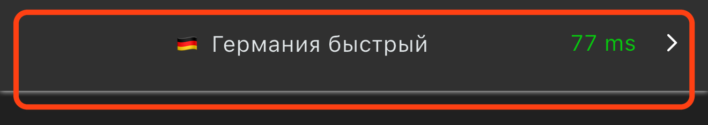
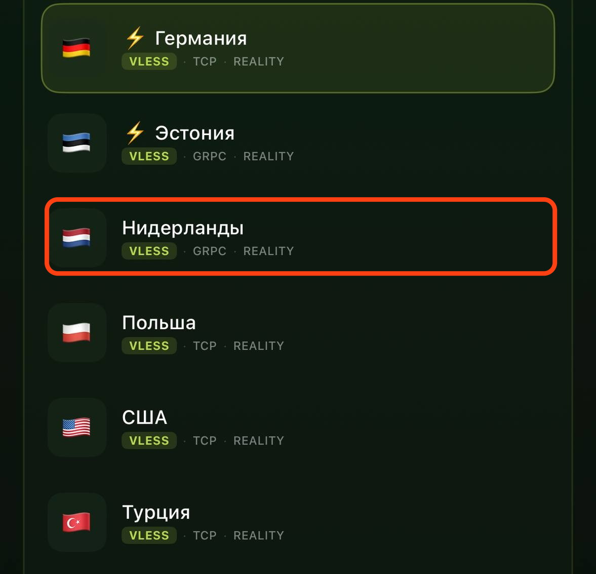
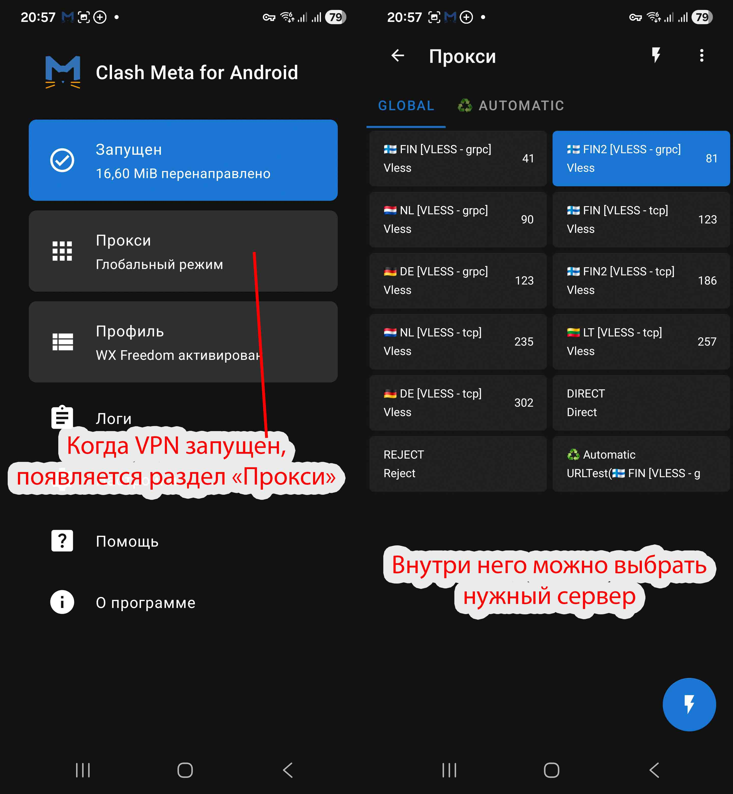
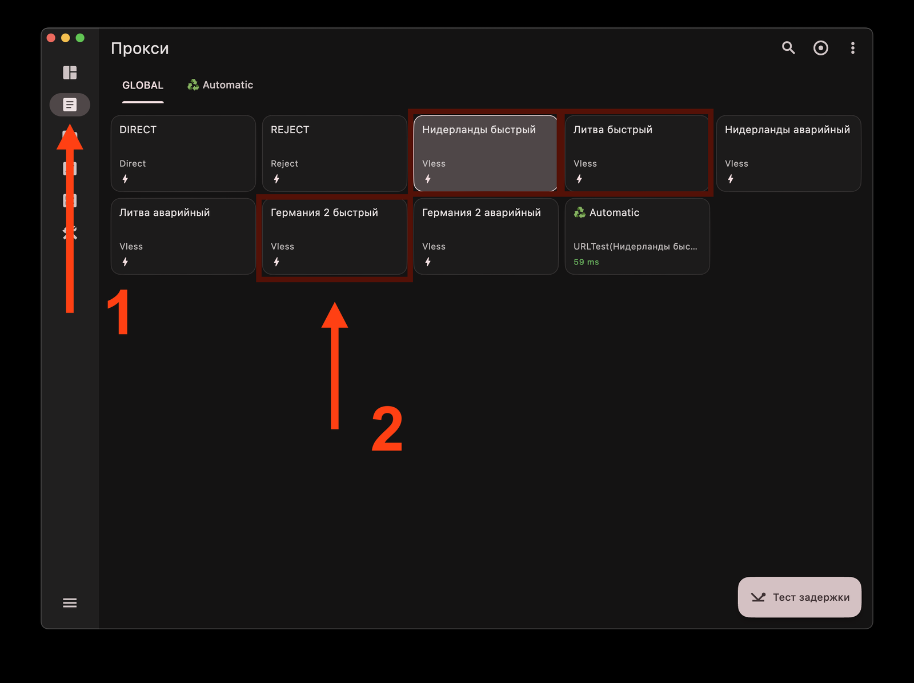
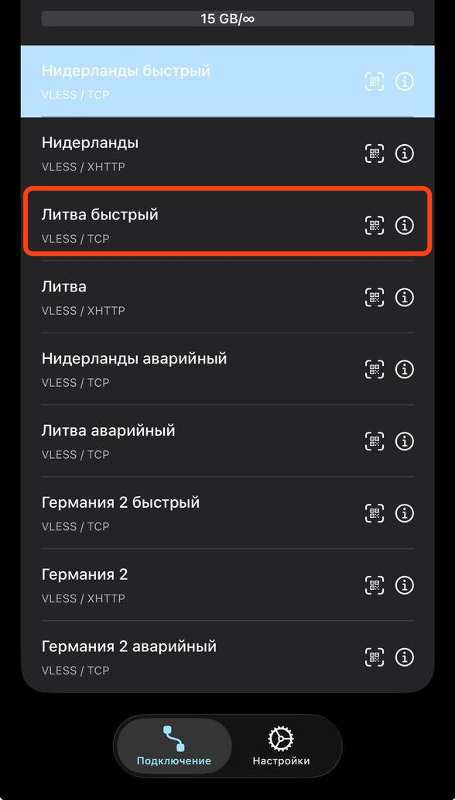

# Как сменить страну

В подписке несколько ключей - по одному на каждую страну. Переключаться между ними можно в любой момент, заново добавлять подписку не нужно.

Найдите ниже раздел своего приложения.

---

## Clash Mi (iOS / iPadOS)

1. На главном экране проверьте, что выбран режим **Глобально**
2. Откройте раздел **Прокси** и нажмите на строку **GLOBAL**
3. Выберите нужную страну из списка

---

## Hiddify (Android / macOS / Windows / iOS)

Список серверов открывается только когда VPN подключён.

1. Подключитесь - нажмите большую круглую кнопку на вкладке **Главная**
2. Откройте список серверов. На компьютере это раздел **Прокси** в меню слева. На телефоне - карточка активного прокси, она появляется на главном экране под кнопкой подключения; в старых версиях приложения это отдельная вкладка **Прокси** внизу экрана
3. Нажмите на нужную страну в списке

---

## Happ (iOS / Android / macOS / Windows)

1. На главном экране найдите блок **Список серверов**
2. Нажмите на строку с нужной страной

Нажимайте именно на строку. Стрелка `>` справа открывает настройки сервера, а не переключает на него.

---

## Karing (iOS / iPadOS)

1. Внизу главного экрана нажмите на строку с текущим сервером - в ней показаны флаг, название и задержка
2. Откроется экран **Выбор сервера**. Найдите группу с названием вашей подписки и нажмите на нужную страну
3. Переподключаться не нужно - Karing сам переключит соединение

---

## INCY (iOS / iPadOS)

1. Внизу экрана откройте вкладку **Серверы**
2. Нажмите на строку с нужной страной - выбранная обводится рамкой

---

## Clash Meta for Android

Раздел **Прокси** появляется только когда VPN запущен.

1. Запустите VPN на главном экране
2. Откройте раздел **Прокси**
3. На вкладке **GLOBAL** нажмите на нужную страну

---

## FlClash (macOS)

1. В левом меню откройте раздел **Прокси**
2. На вкладке **GLOBAL** нажмите на плитку с нужной страной

---

## V2RayTun (iOS)

1. На вкладке **Подключение** раскройте свою подписку
2. Нажмите на строку с нужной страной - выбранная подсвечивается синим

---

## Важно

Не выбирайте ключи с пометкой **Аварийный**. Используйте их только в случае, если не работает ни один из обычных ключей.

## Полезное

- [Как обновить подписку](update-subscription.md)
- [Не работает VPN?](troubleshooting.md)

---

[← К выбору операционной системы](README.md)
