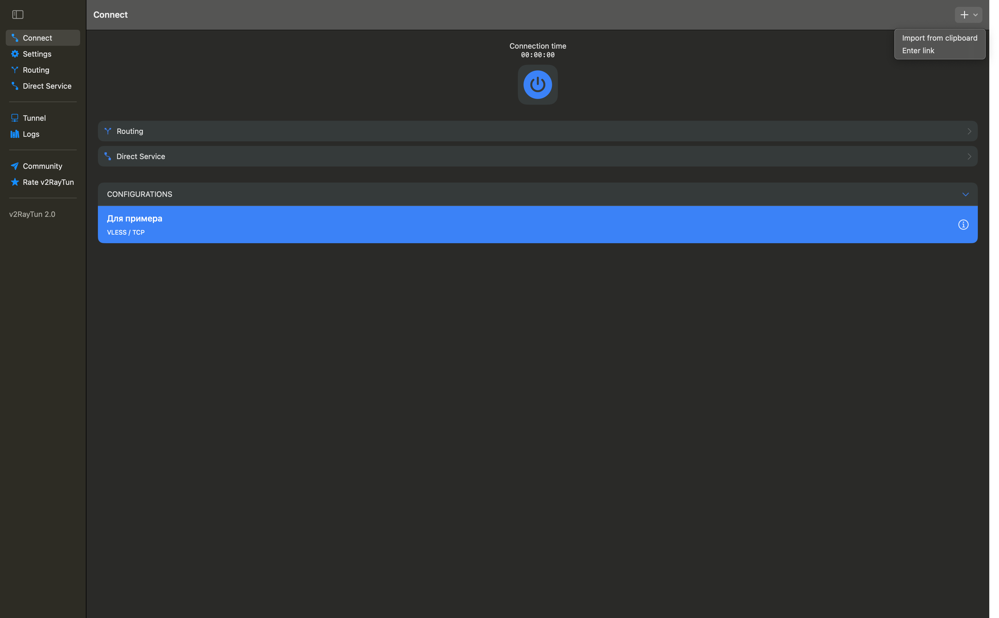
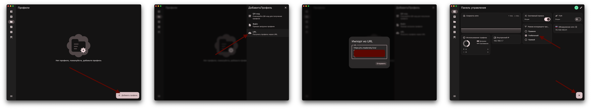
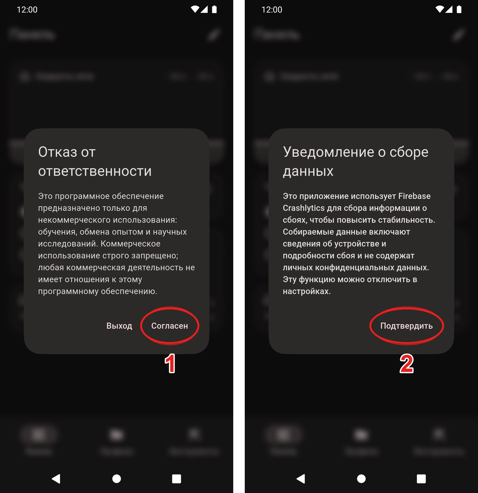
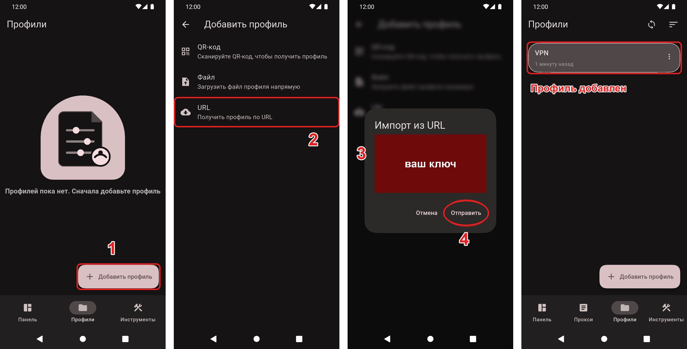
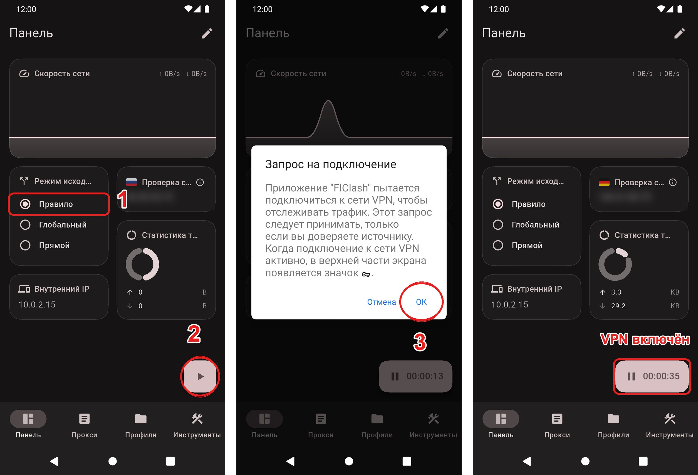
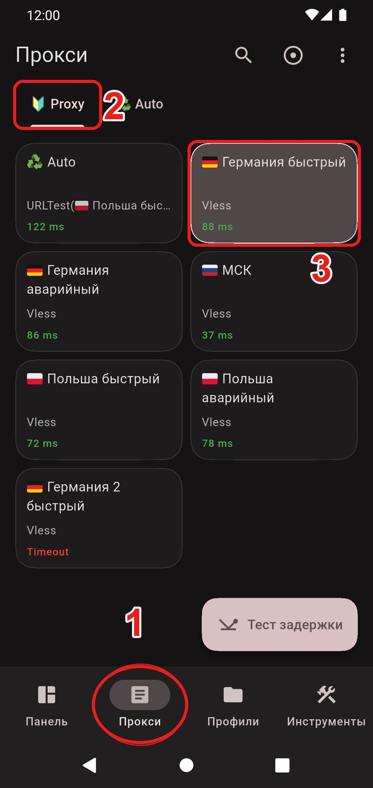

# FlClash (альтернатива)

Альтернативное приложение для macOS и Android. Основное приложение - Hiddify: [инструкция для macOS](macos.md), [инструкция для Android](android.md).

- [FlClash для macOS](#macos)
- [FlClash для Android](#android)

---

## macOS

### Шаг 1. Скачайте и установите приложение

[Скачать FlClash](https://github.com/chen08209/FlClash/releases/download/v0.8.92/FlClash-0.8.92-macos-arm64.dmg)

1. Откройте скачанный `.dmg` и перетащите **FlClash** в папку **Applications**
2. При первом запуске macOS заблокирует приложение - нажмите **Готово**
3. Откройте **Системные настройки → Конфиденциальность и безопасность** и разрешите запуск FlClash
4. Запустите приложение ещё раз и нажмите **Все равно открыть**

### Шаг 2. Добавьте профиль

1. Скопируйте ключ, который я отправил
2. Перейдите в раздел **Профили** и нажмите **Добавить профиль**
3. Выберите способ **URL**
4. Вставьте ключ в поле и нажмите **Отправить**
5. Перейдите в **Панель управления**, в блоке **Режим исходящего трафика** оставьте **Правило** и нажмите кнопку запуска в правом нижнем углу

Как выбрать страну вручную - в разделе [Как сменить страну](change-country.md#flclash-macos--android).

---

## Android

### Шаг 1. Скачайте и установите приложение

[Скачать FlClash для Android](https://github.com/chen08209/FlClash/releases/download/v0.8.98/FlClash-0.8.98-android-arm64-v8a.apk)

Откройте скачанный `.apk` и установите приложение. Если Android заблокирует установку, разрешите установку из неизвестных источников в настройках.

### Шаг 2. Первый запуск

При первом запуске приложение покажет два окна:

1. **Отказ от ответственности** - нажмите **Согласен**
2. **Уведомление о сборе данных** - нажмите **Подтвердить**

### Шаг 3. Добавьте профиль

1. Скопируйте ключ, который я отправил
2. Внизу экрана откройте вкладку **Профили** и нажмите **Добавить профиль**
3. Выберите **URL**
4. Вставьте ключ в поле
5. Нажмите **Отправить** - в списке появится профиль

### Шаг 4. Подключитесь

1. Откройте вкладку **Панель**. В блоке **Режим исходящего трафика** должен быть выбран режим **Правило** - он стоит по умолчанию, менять не нужно
2. Нажмите круглую кнопку запуска в правом нижнем углу
3. При первом подключении Android попросит разрешение на VPN - нажмите **ОК**

Когда VPN работает, на кнопке идёт таймер, а в строке состояния появляется значок ключа.

### Шаг 5. Выберите страну (по желанию)

По умолчанию стоит **Auto** - приложение само выбирает самый быстрый сервер. Чтобы выбрать страну вручную:

1. Внизу экрана откройте вкладку **Прокси**
2. Вверху выберите вкладку **Proxy**
3. Нажмите на нужную страну - выбранная подсвечивается

---

## Важно

Не выбирайте ключи с пометкой **Аварийный**. Используйте их только в случае, если не работает ни один из обычных ключей.

## Полезное

- [Как обновить подписку](update-subscription.md#flclash-macos--android)
- [Как сменить страну](change-country.md#flclash-macos--android)
- [Не работает VPN?](troubleshooting.md)

---

[← Вернуться к инструкции для macOS](macos.md) · [← Вернуться к инструкции для Android](android.md)
