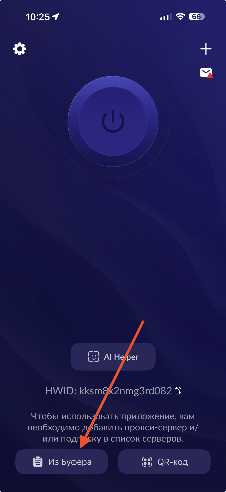

# Универсальная инструкция (Happ)

Подходит для iOS, iPadOS, Android, macOS и Windows.

## Шаг 1. Скачайте и установите приложение

- [iOS / iPadOS / macOS - App Store](https://apps.apple.com/ru/app/happ-proxy-utility-plus/id6746188973)
- [Android - Google Play](https://play.google.com/store/apps/details?id=com.happproxy)
- [Windows - установщик](https://github.com/Happ-proxy/happ-desktop/releases/latest/download/setup-Happ.x64.exe)

## Шаг 2. Добавьте профиль

1. Скопируйте ключ, который я отправил
2. На главном экране нажмите кнопку **Из Буфера** внизу слева

## Шаг 3. Подключитесь

Нажмите большую круглую кнопку питания в центре экрана.

## Важно

Не выбирайте ключи с пометкой **Аварийный**. Используйте их только в случае, если не работает ни один из обычных ключей.
