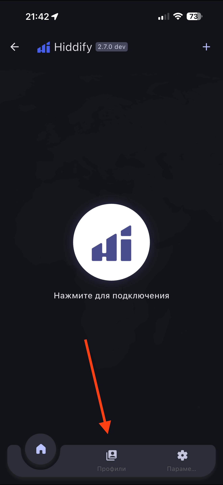
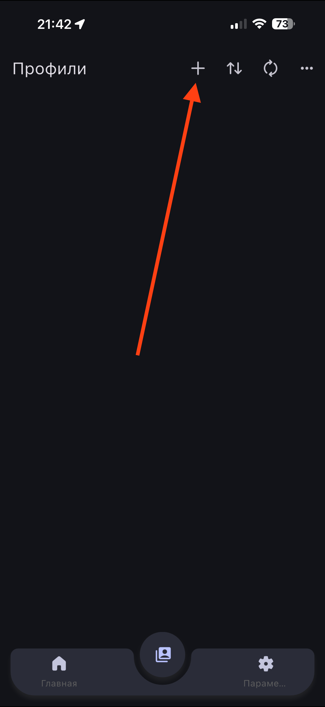
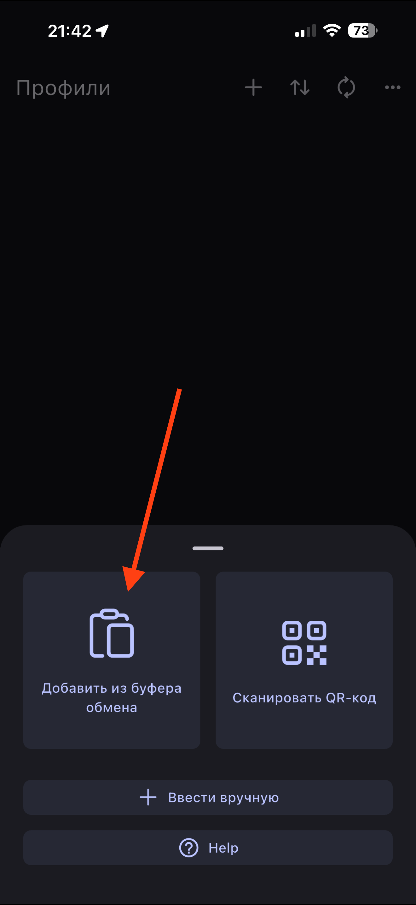
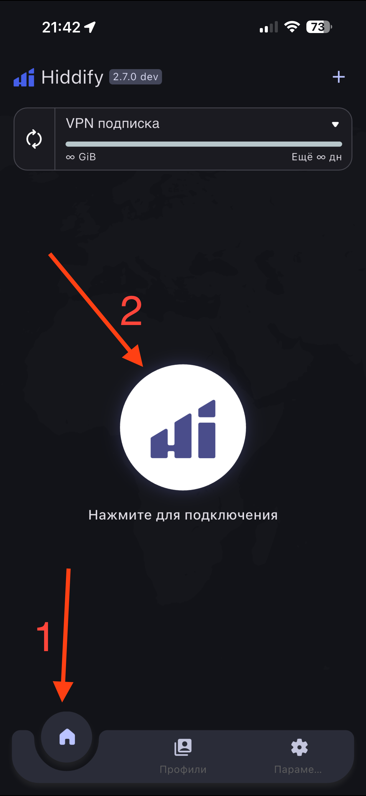

# Универсальная инструкция (Hiddify)

Подходит для iOS, iPadOS, Android, macOS и Windows.

## Шаг 1. Скачайте и установите приложение

- [iOS / iPadOS - App Store](https://apps.apple.com/us/app/hiddify-proxy-vpn/id6596777532)
- [Android - Google Play](https://play.google.com/store/apps/details?id=app.hiddify.com) ([APK](https://github.com/hiddify/hiddify-app/releases/latest/download/Hiddify-Android-universal.apk), если Google Play недоступен)
- [macOS - установщик](https://github.com/hiddify/hiddify-app/releases/latest/download/Hiddify-MacOS.dmg)
- [Windows - установщик](https://github.com/hiddify/hiddify-app/releases/latest/download/Hiddify-Windows-Setup-x64.exe)

На Windows при предупреждении SmartScreen нажмите **Подробнее → Выполнить в любом случае**. На macOS при блокировке разрешите запуск в **Системные настройки → Конфиденциальность и безопасность**.

## Шаг 2. Добавьте профиль

1. Скопируйте ключ, который я отправил
2. Внизу экрана откройте вкладку **Профили**

3. Нажмите **+** в правом верхнем углу

4. Выберите **Добавить из буфера обмена**

## Шаг 3. Подключитесь

1. Вернитесь на вкладку **Главная** внизу слева
2. Нажмите большую круглую кнопку подключения в центре экрана

## Важно

Не выбирайте ключи с пометкой **Аварийный**. Используйте их только в случае, если не работает ни один из обычных ключей.
