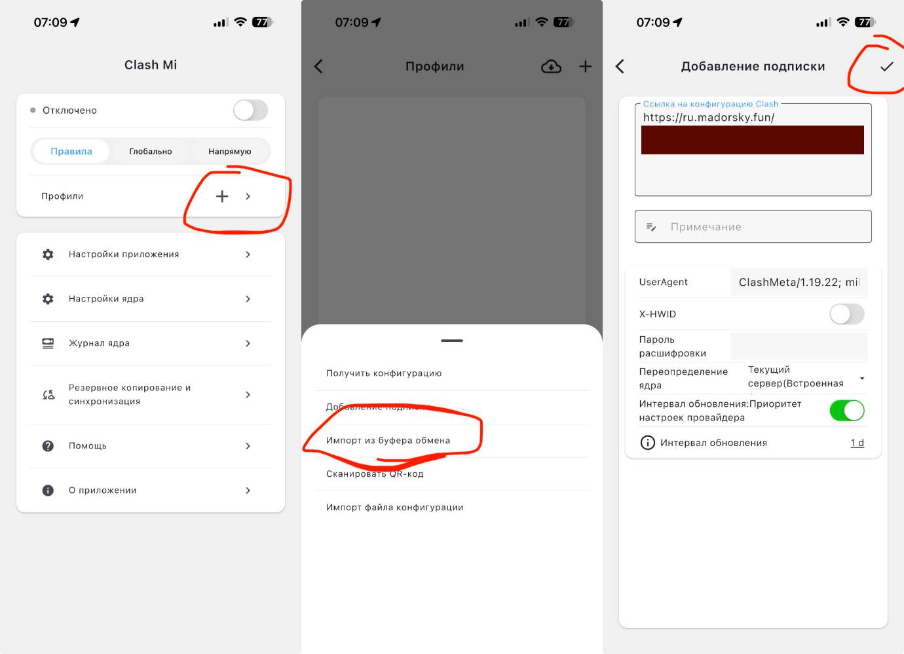
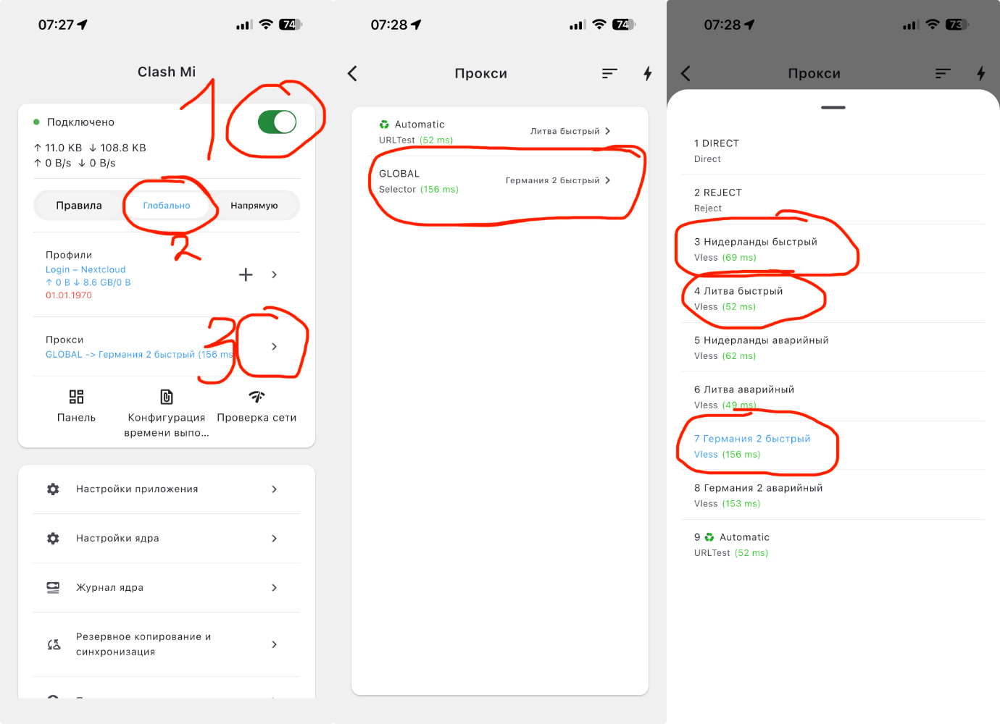

# iOS/iPadOS

## Шаг 1. Скачайте приложение

[Скачать Clash Mi из App Store](https://apps.apple.com/ru/app/clash-mi/id6744321968)

## Шаг 2. Добавьте профиль

1. Скопируйте ключ, который я отправил
2. Нажмите на кнопку **+** рядом с пунктом **Профили**
3. Выберите **Импорт из буфера обмена**
4. Нажмите галочку в правом верхнем углу

## Шаг 3. Подключитесь и выберите ключ

1. Включите переключатель в верхней части экрана
2. Перейдите на вкладку **Глобально**
3. Нажмите на строку **Прокси**
4. Выберите нужный ключ из списка

> **Важно:** не выбирайте ключи с пометкой **Аварийный**. Используйте их только в случае, если не работает ни один из обычных ключей.

