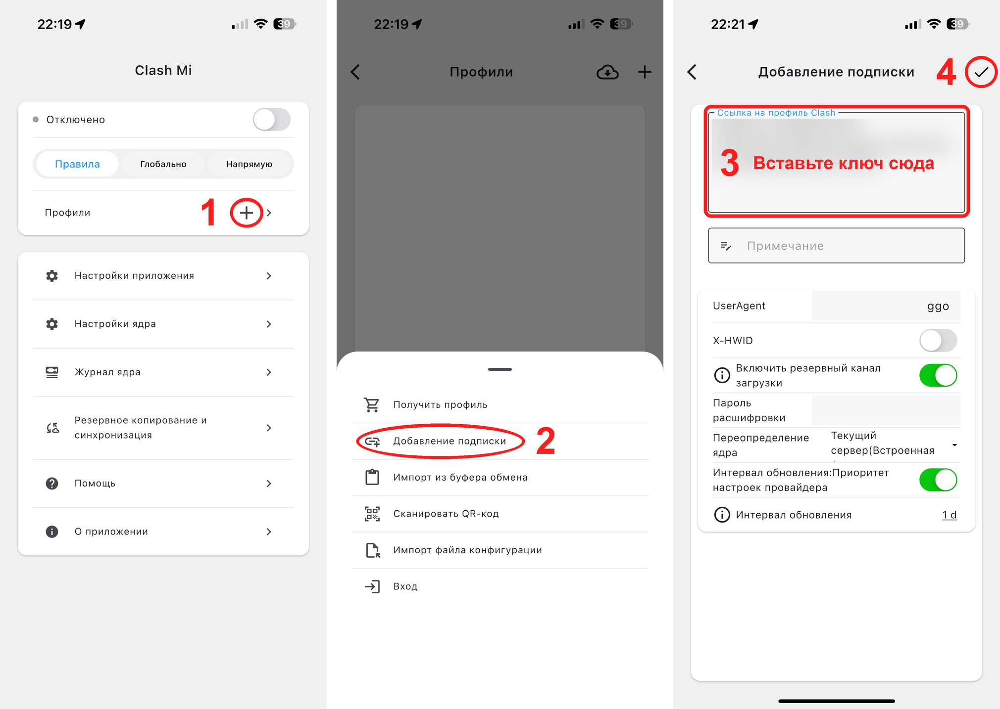
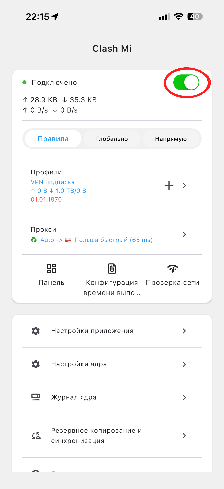

# 🍎 iOS / iPadOS

Основное приложение - **Clash Mi**.

## Шаг 1. Скачайте приложение

[Скачать Clash Mi из App Store](https://apps.apple.com/ru/app/clash-mi/id6744321968)

## Шаг 2. Добавьте профиль

1. Скопируйте ключ, который я отправил
2. Нажмите на кнопку **+** рядом с пунктом **Профили**
3. Выберите **Импорт из буфера обмена**
4. Нажмите галочку в правом верхнем углу

## Шаг 3. Подключитесь и выберите ключ

1. Включите переключатель в верхней части экрана
2. Выберите режим **Глобально**
3. Откройте раздел **Прокси** и нажмите на строку **GLOBAL**
4. Выберите нужную страну из списка

## Важно

Не выбирайте ключи с пометкой **Аварийный**. Используйте их только в случае, если не работает ни один из обычных ключей.

## Полезное

- [Как обновить подписку](update-subscription.md)
- [Не работает VPN?](troubleshooting.md)

## Не заработало? Попробуйте другое приложение

- [Karing](karing.md)
- [INCY](incy.md)
- [Happ](happ.md)
- [Hiddify](hiddify-ios.md) - *доступен не во всех регионах App Store*

---

[← К выбору операционной системы](README.md)
