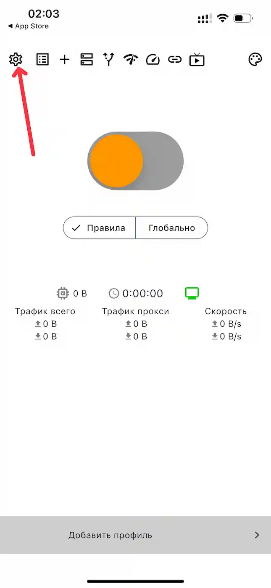
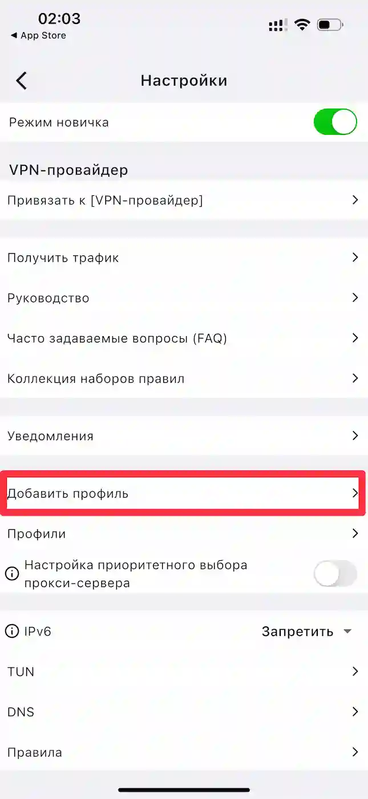
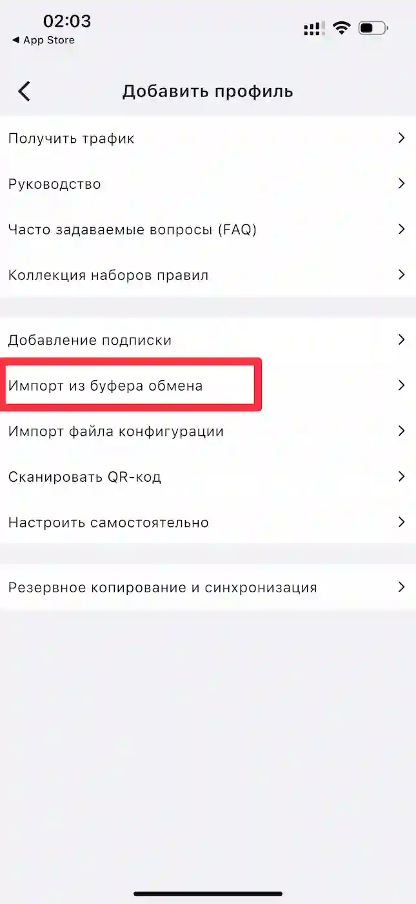
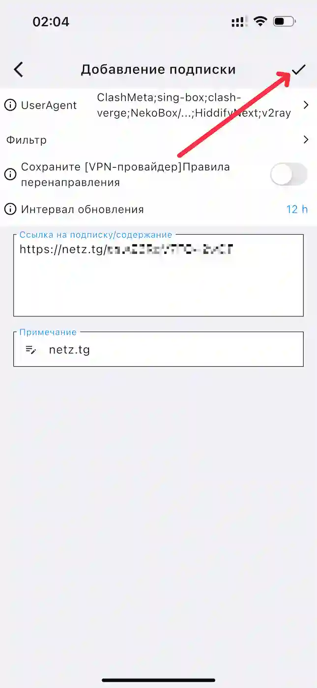
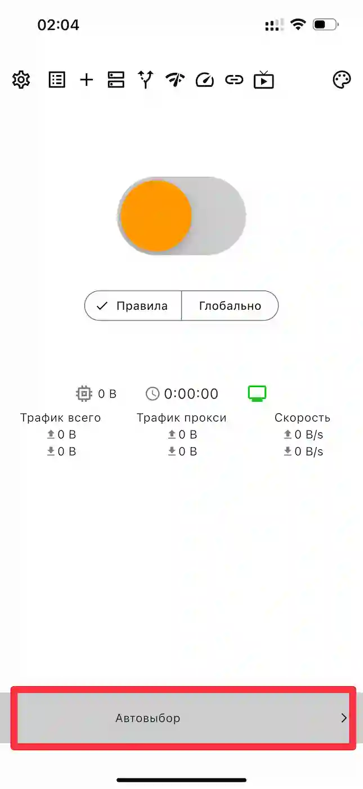
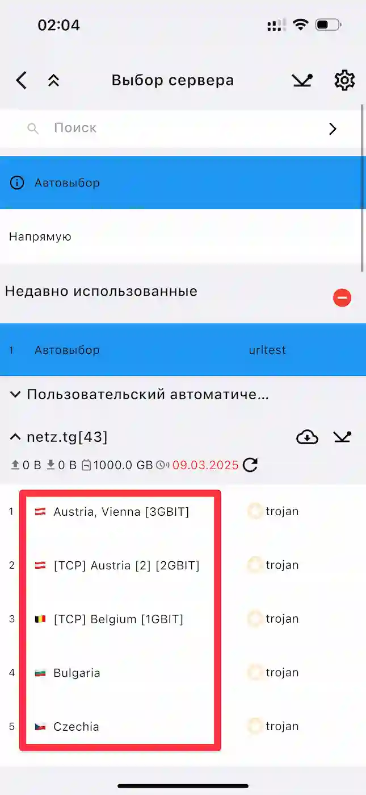
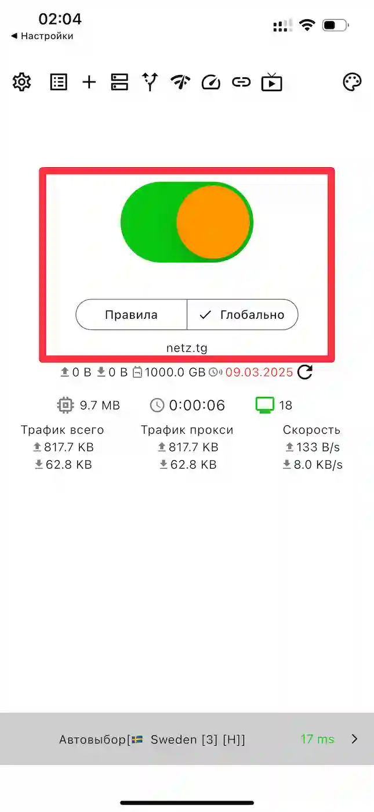

# iOS/iPadOS (Karing)

## Шаг 1. Скачайте приложение

[Скачать Karing из App Store](https://apps.apple.com/ru/app/karing/id6472431552)

## Шаг 2. Добавьте профиль

1. Скопируйте ключ, который я отправил
2. На главном экране нажмите иконку **шестерёнки** в левом верхнем углу

3. Выберите пункт **Добавить профиль**

4. Нажмите **Импорт из буфера обмена**

5. Убедитесь, что ссылка вставилась в поле, и нажмите **галочку** в правом верхнем углу

## Шаг 3. Выберите сервер и подключитесь

1. Внизу главного экрана нажмите кнопку **Автовыбор**

2. Выберите нужную страну из списка серверов

3. Нажмите большой круглый переключатель вверху экрана. При первом подключении разрешите приложению добавить VPN-конфигурацию в настройки iPhone. Когда переключатель станет зелёным - VPN подключён

## Важно

Не выбирайте ключи с пометкой **Аварийный**. Используйте их только в случае, если не работает ни один из обычных ключей.
