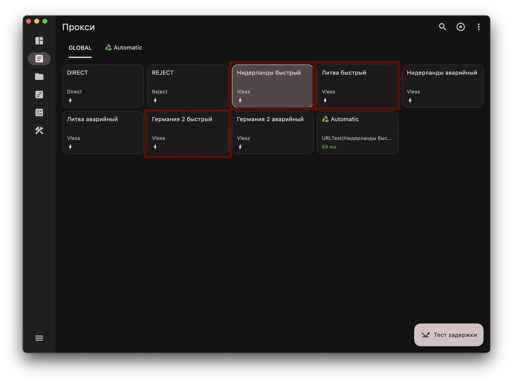

# macOS

## Шаг 1. Скачайте и установите приложение

[Скачать FlClash](https://github.com/chen08209/FlClash/releases/download/v0.8.92/FlClash-0.8.92-macos-arm64.dmg)

1. Откройте скачанный `.dmg` и перетащите **FlClash** в папку **Applications**
2. При первом запуске macOS заблокирует приложение - нажмите **Готово**
3. Откройте **Системные настройки → Конфиденциальность и безопасность** и разрешите запуск FlClash
4. Запустите приложение ещё раз и нажмите **Все равно открыть**

## Шаг 2. Добавьте профиль

1. Скопируйте ключ, который я отправил
2. Перейдите в раздел **Профили** и нажмите **Добавить профиль**
3. Выберите способ **URL**
4. Вставьте ключ в поле и нажмите **Отправить**
5. Перейдите в **Панель управления**, в блоке **Режим исходящего трафика** выберите **Глобальный** и нажмите кнопку запуска в правом нижнем углу

## Шаг 3. Выберите ключ

Перейдите в раздел **Прокси**, вкладка **GLOBAL**, и выберите нужный ключ.

> **Важно:** не выбирайте ключи с пометкой **Аварийный**. Используйте их только в случае, если не работает ни один из обычных ключей.

