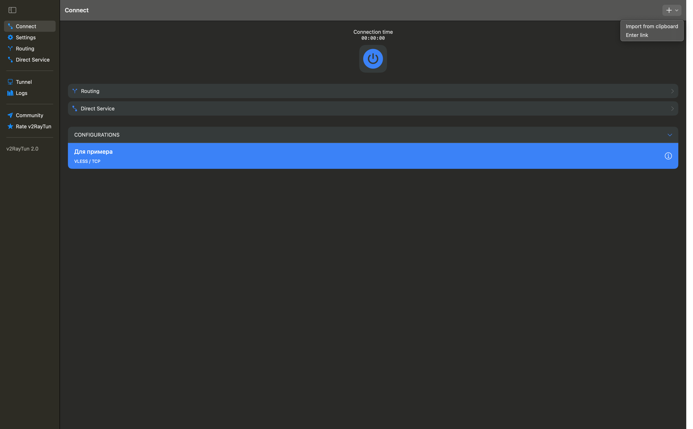
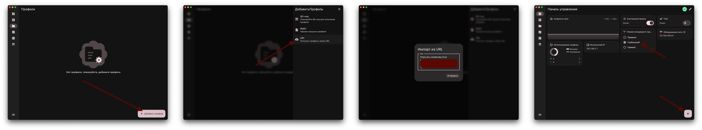

# macOS

## Шаг 1. Скачайте приложение

[Скачать V2RayTun из App Store](https://apps.apple.com/ru/app/v2raytun/id6476628951)

## Шаг 2. Импортируйте конфигурацию

1. Скопируйте конфигурацию, которую я отправил
2. Нажмите на кнопку **+** в правом верхнем углу
3. Выберите **Import from clipboard**
4. Нажмите синюю кнопку включения
5. Разрешите добавление VPN-конфигурации

