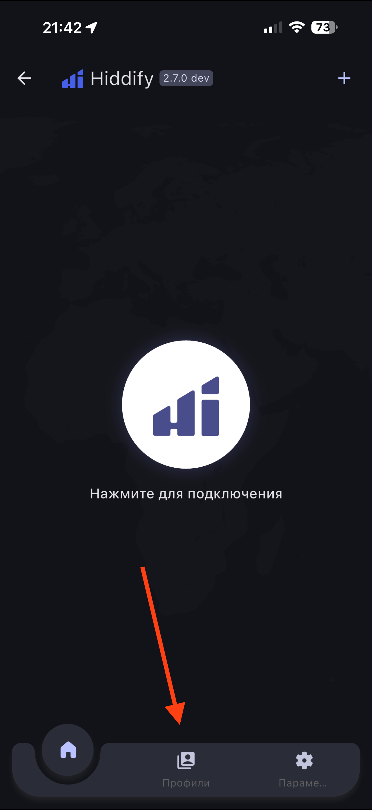
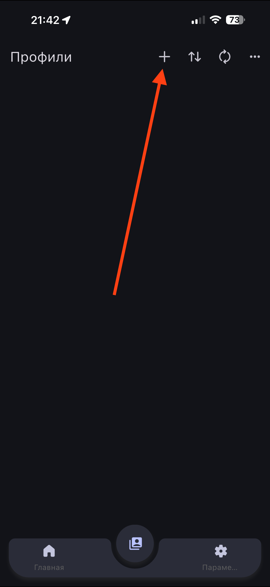
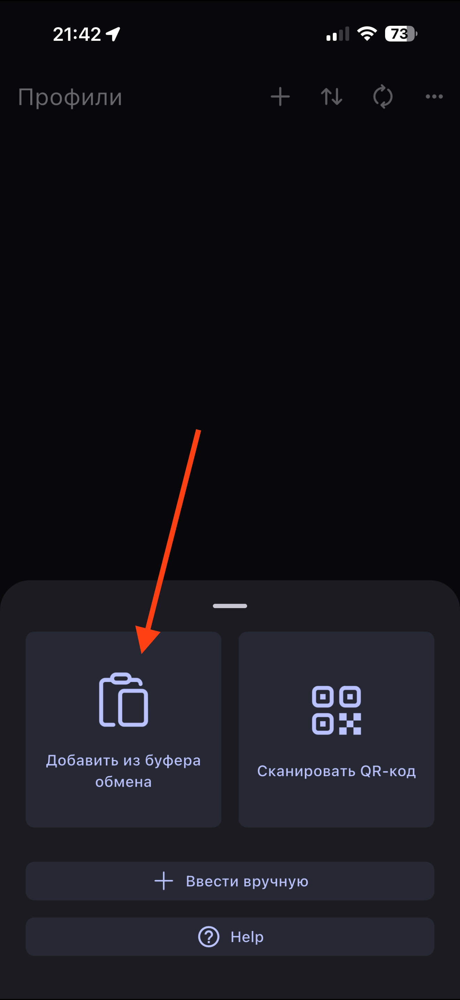
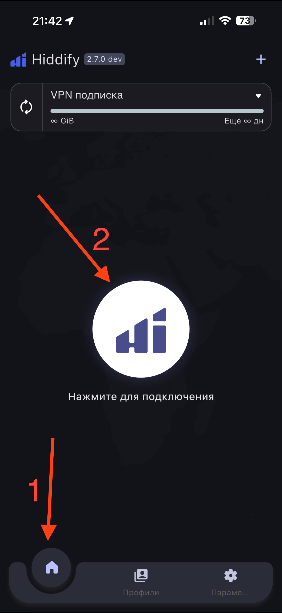

# 🍏 macOS

Основное приложение - **Hiddify**.

## Шаг 1. Скачайте и установите приложение

[Скачать Hiddify](https://github.com/hiddify/hiddify-app/releases/latest/download/Hiddify-MacOS.dmg)

1. Откройте скачанный `.dmg` и перетащите **Hiddify** в папку **Applications**
2. При первом запуске macOS заблокирует приложение - нажмите **Готово**
3. Откройте **Системные настройки → Конфиденциальность и безопасность** и разрешите запуск Hiddify
4. Запустите приложение ещё раз и нажмите **Все равно открыть**

## Шаг 2. Добавьте профиль

1. Скопируйте ключ, который я отправил
2. Откройте вкладку **Профили**

3. Нажмите **+** в правом верхнем углу

4. Выберите **Добавить из буфера обмена**

## Шаг 3. Подключитесь

1. Вернитесь на вкладку **Главная**
2. Нажмите большую круглую кнопку подключения в центре экрана
3. При первом подключении разрешите добавить VPN-конфигурацию в системные настройки

## Важно

Не выбирайте ключи с пометкой **Аварийный**. Используйте их только в случае, если не работает ни один из обычных ключей.

## Полезное

- [Как обновить подписку](update-subscription.md)
- [Не работает VPN?](troubleshooting.md)

## Не заработало? Попробуйте другое приложение

- [Happ](happ.md)
- [FlClash](flclash.md)

---

[← К выбору операционной системы](README.md)
