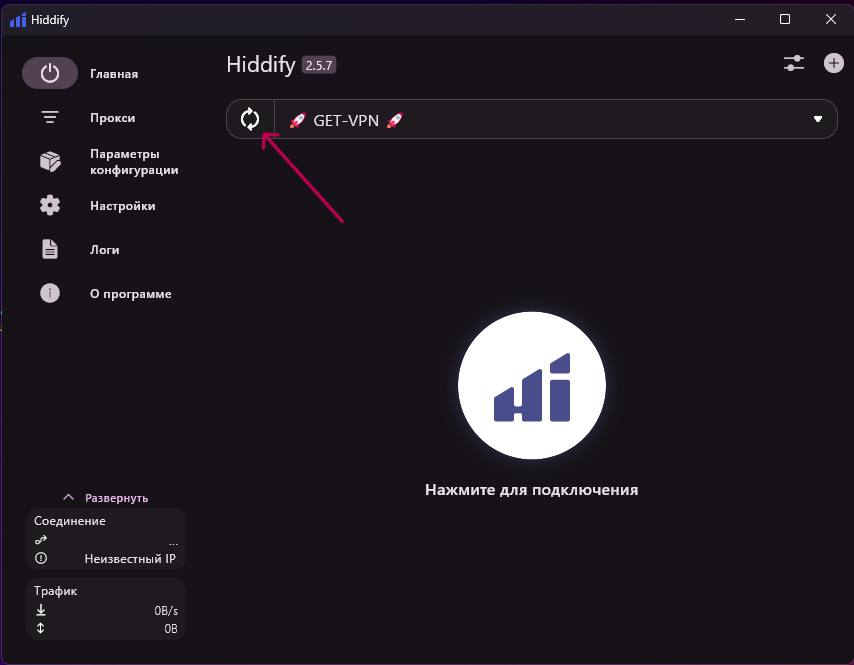
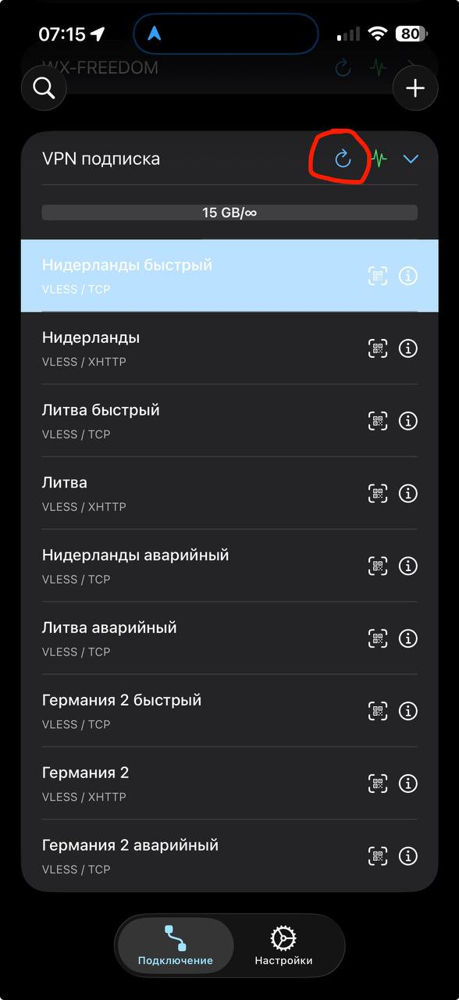
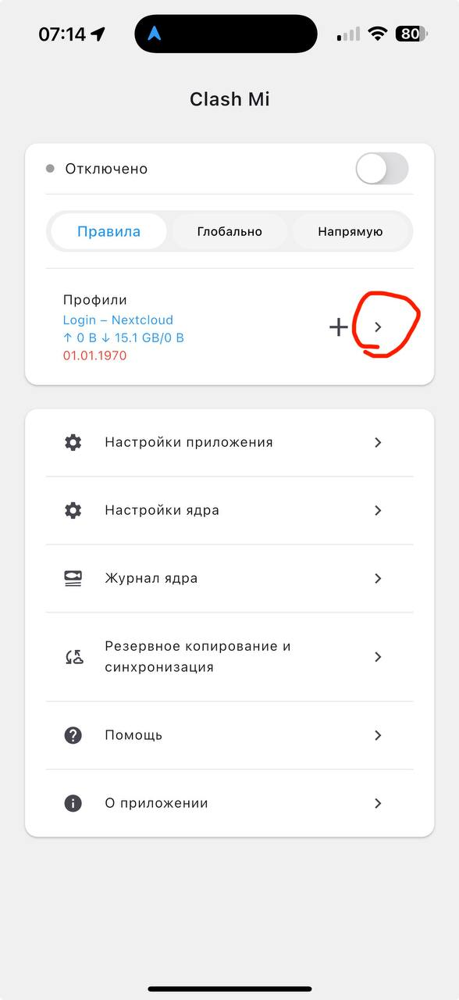
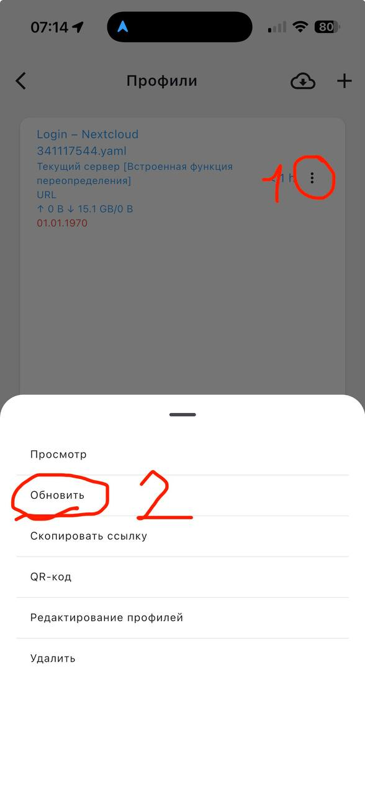

# Как обновить подписку

---

## Hiddify (Windows / macOS / Linux / Android / iOS)

Нажми на иконку обновления рядом с названием подписки:

---

## V2RayTun (iOS)

Нажми на иконку обновления (круговая стрелка) рядом с подпиской:

---

## Clash Mi (iOS)

**Шаг 1.** На главном экране нажми стрелку `>` рядом с профилем, чтобы перейти в раздел "Профили":

**Шаг 2.** Нажми на три точки `...` рядом с профилем (1), затем выбери "Обновить" (2):

