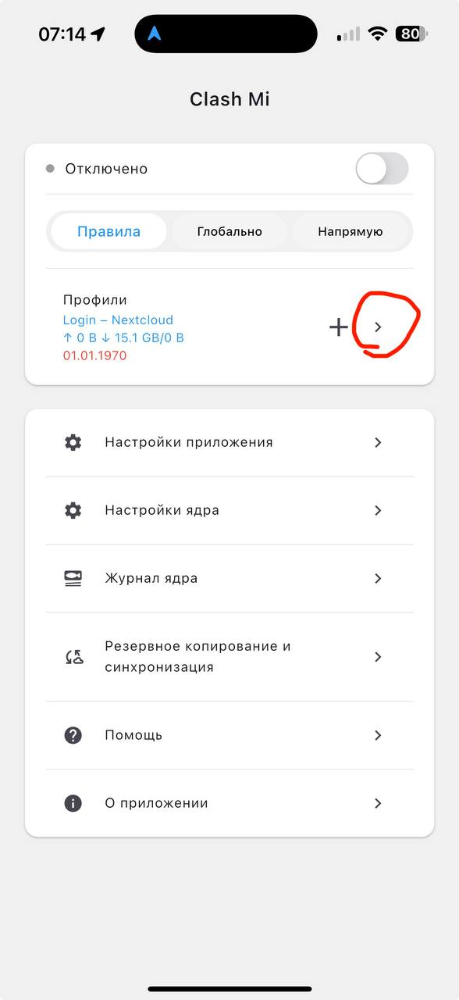
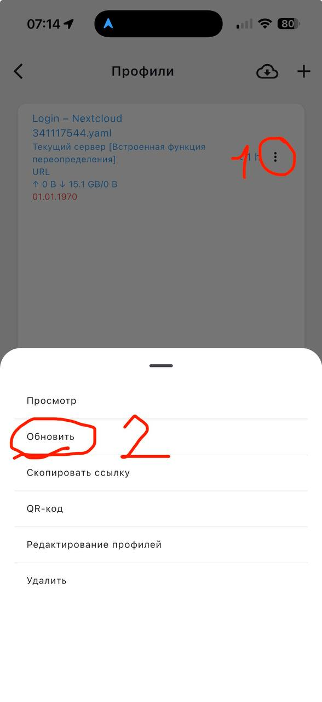
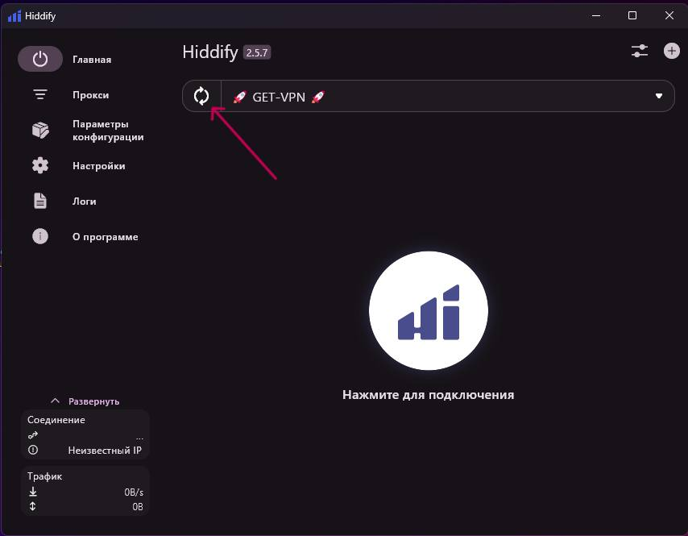
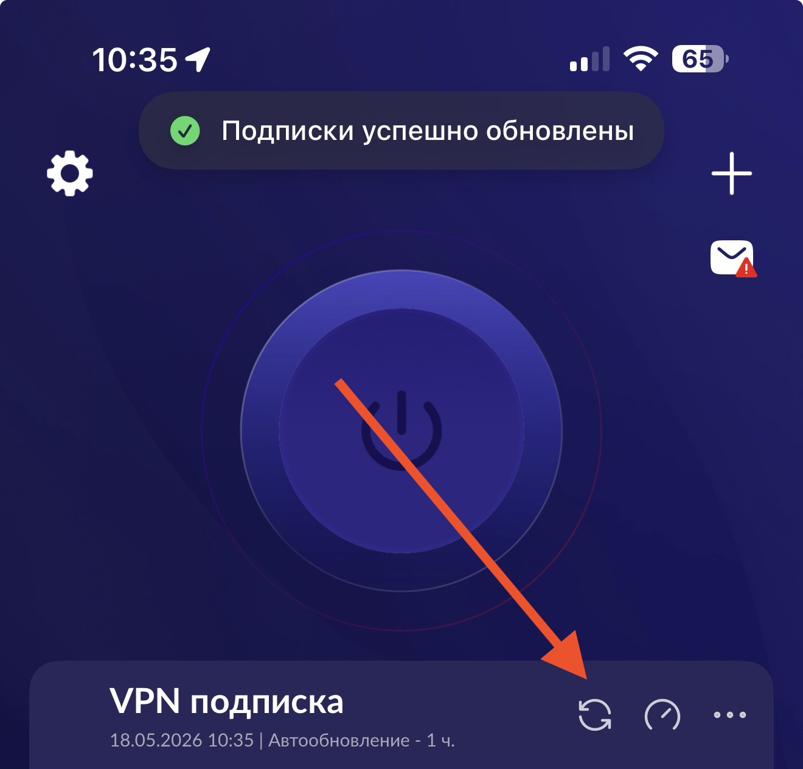
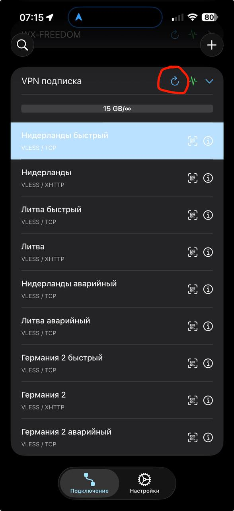

# Как обновить подписку

Найдите ниже раздел своего приложения.

---

## Clash Mi (iOS / iPadOS)

**Шаг 1.** На главном экране нажми стрелку `>` рядом с профилем, чтобы перейти в раздел "Профили":

**Шаг 2.** Нажми на три точки `...` рядом с профилем (1), затем выбери "Обновить" (2):

---

## Hiddify (Android / macOS / Windows / iOS)

Нажми на иконку обновления рядом с названием подписки:

---

## Happ (iOS / Android / macOS / Windows)

На главном экране нажмите иконку обновления (круговые стрелки) рядом с подпиской:

---

## V2RayTun (iOS)

Нажми на иконку обновления (круговая стрелка) рядом с подпиской:

---

[← К выбору операционной системы](README.md)
