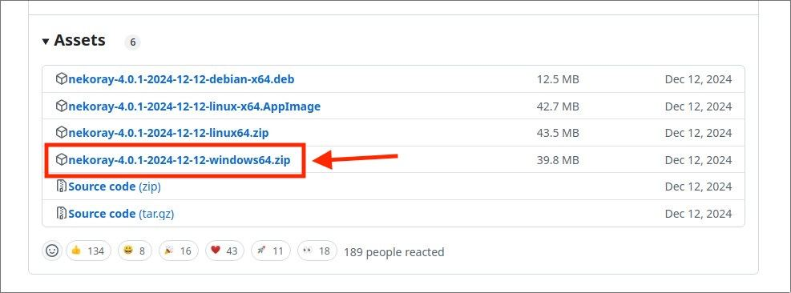
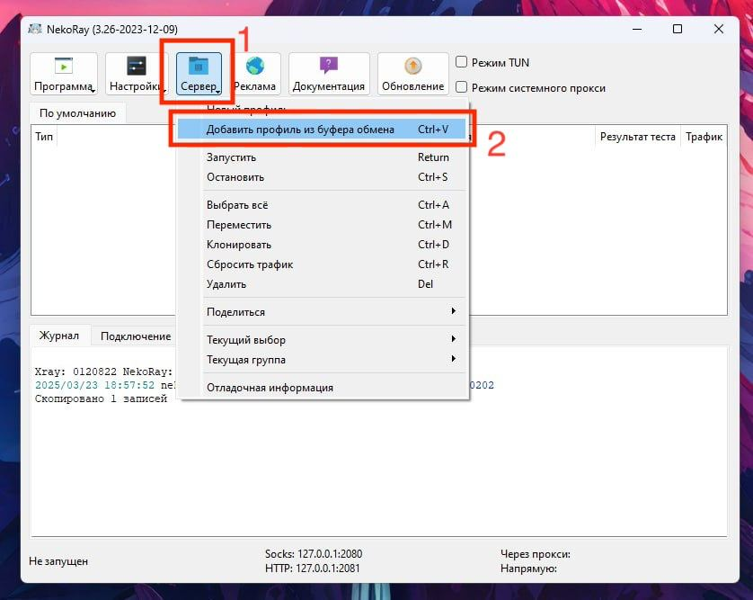
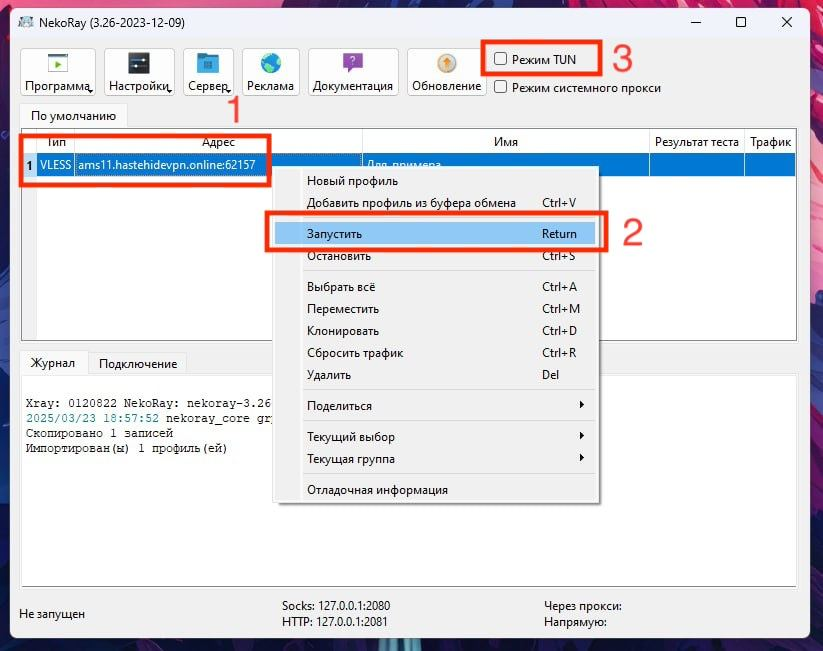

# Windows

## Шаг 1. Скачайте приложение

[Скачать Nekoray](https://en.nekoray.org/download/)

## Шаг 2. Импортируйте конфигурацию

1. Скопируйте ключ из Telegram, который я отправил
2. Выполните действия на скриншоте

## Шаг 3. Подключитесь к VPN

