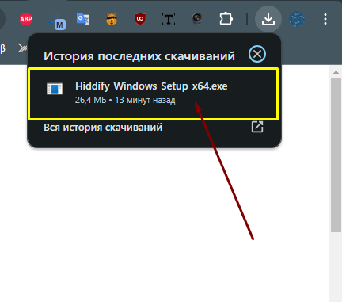
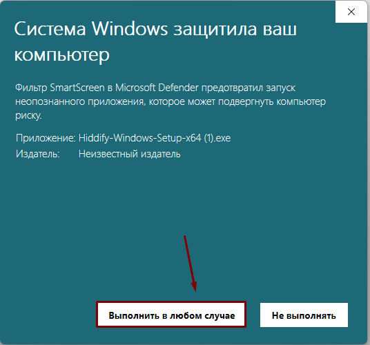
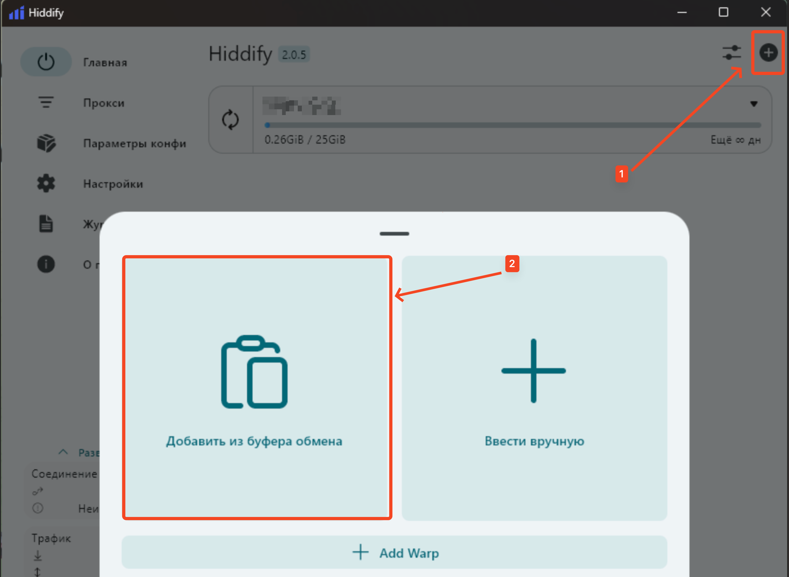

# Windows

## Шаг 1. Скачайте установщик

[Скачать Hiddify](https://github.com/hiddify/hiddify-next/releases/latest/download/Hiddify-Windows-Setup-x64.exe)

Запустите скачанный файл из папки **Загрузки**.

## Шаг 2. Установите приложение

Если Windows покажет предупреждение SmartScreen - нажмите **Подробнее → Выполнить в любом случае**, затем пройдите обычную установку.

## Шаг 3. Добавьте профиль

1. Скопируйте ключ, который я отправил
2. Откройте приложение, на вкладке **Главная** нажмите **+** в правом верхнем углу
3. Выберите **Добавить из буфера обмена**

## Шаг 4. Подключитесь и выберите ключ

Нажмите большую кнопку в центре экрана для подключения, затем на вкладке **Прокси** выберите нужную локацию.

> **Важно:** не выбирайте ключи с пометкой **Аварийный**. Используйте их только в случае, если не работает ни один из обычных ключей.
